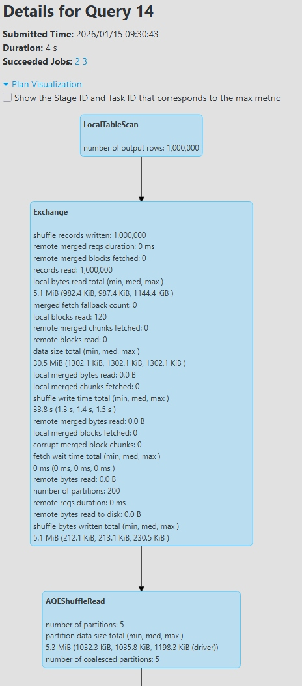
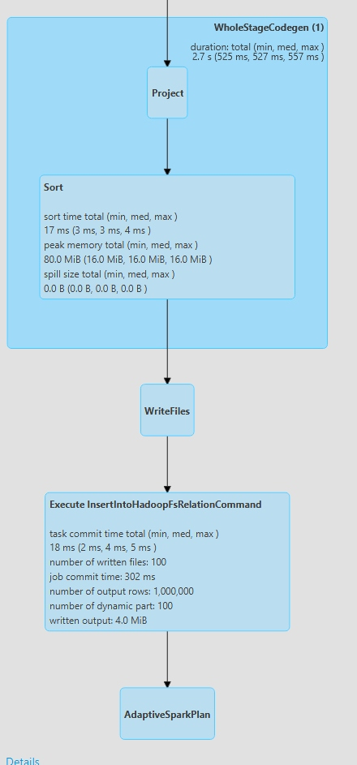
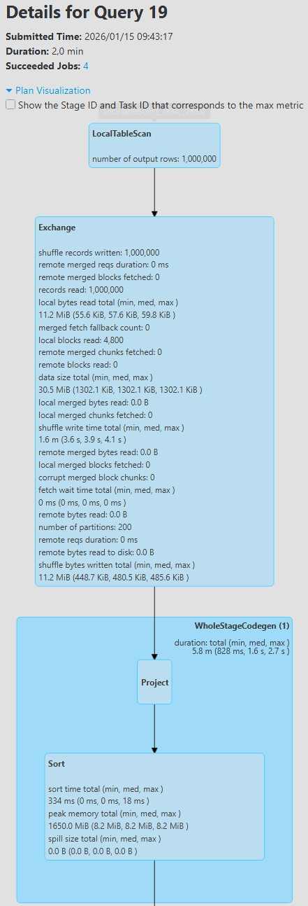
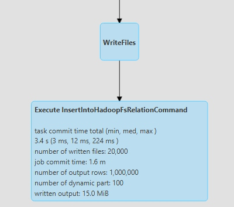
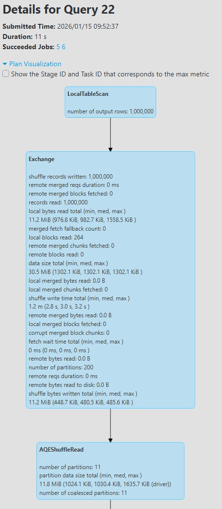
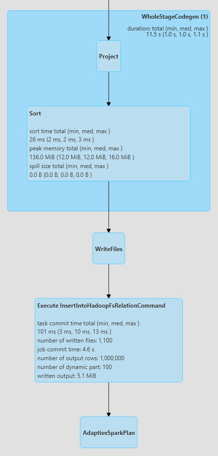

# Exercise 1 – create table, repartition, insertInto

## Code used

```scala
val ds = spark.createDataset((1 to 1000000).map(x => (s"$x", x % 100)))

// TEST_PART1:
spark.sql("drop table if exists db1.test_part1");
spark.sql("create table db1.test_part1 (col1 string) partitioned by (part1 int) stored as parquet");
ds.repartition(25).write.mode("overwrite").insertInto("db1.test_part1");
```

The dataset `ds` contains 1,000,000 rows, with a logical schema `(col1: string, part1: int)` where `part1 = x % 100`. 
The table `db1.test_part1` is a Hive table partitioned on `part1` and stored as parquet in the Spark warehouse.

---

## Question 1 – Directory and files structure

The table `db1.test_part1` is stored in the Spark/Hive metastore directory, typically:

- Base directory of the database: `.../spark-warehouse/db1.db/`.  
- Table directory: `.../spark-warehouse/db1.db/test_part1/`. 
- Inside this directory, Spark creates one subdirectory per partition value of `part1`, from `0` to `99`:  
  - `part1=0/`, `part1=1/`, …, `part1=99/`.

Each `part1=k/` directory contains one or several parquet files with names such as:

- `part-*****.snappy.parquet` (exact names depend on the run).

So the logical structure is:

- 1 root directory for the table.  
- 100 partition subdirectories (`part1=0` to `part1=99`).  
- Parquet files stored inside each partition directory.

---

## Question 2 – Description of the `insertInto` action

The following call triggers the main action:

```scala
ds.repartition(25)
  .write
  .mode("overwrite")
  .insertInto("db1.test_part1")
```

Step‑by‑step description:

- `repartition(25)` performs a **wide transformation** with a shuffle in order to produce 25 physical RDD partitions containing the 1,000,000 rows. 
- The operation `write.mode("overwrite").insertInto("db1.test_part1")` then:  
  - removes any previous content of the table (`overwrite`),  
  - maps dataset columns to the table columns (`col1`, `part1`),  
  - routes each row to the disk partition corresponding to its `part1` value (directory `part1=k`),  
  - writes the data as parquet files and updates Hive metadata (partition statistics).

In Spark UI (SQL tab → Plan visualization), the physical plan contains an operator `Execute InsertIntoHadoopFsRelationCommand` which writes 1,000,000 rows into 100 dynamic partitions (`part1`) across multiple parquet files.

---

## Question 3 – How Spark executes the action

### 3.1 Number of distinct partition values

Column `part1` is defined as `x % 100` for `x` ranging from 1 to 1,000,000, giving exactly 100 possible values: `0, 1, 2, …, 99`.
Spark UI confirms this via the insert operator which reports `number of dynamic part: 100`, i.e. 100 logical table partitions.

### 3.2 How RDD partitions are divided

Before `repartition`, dataset `ds` has 24 RDD partitions (measured with `ds.rdd.getNumPartitions`).
`repartition(25)` forces a shuffle that redistributes data into **25 physical RDD partitions**, as shown in the `Exchange` block of the plan (`number of partitions: 25`).

Each RDD partition contains a subset of rows with a mix of many different `part1` values (not a single `part1` per RDD partition), because this `repartition(25)` uses only the target number of partitions and not a specific key column.

### 3.3 Jobs, stages, tasks, and side effects of each task

The insert triggers a Spark job associated with the SQL `INSERT INTO db1.test_part1`.  

Spark UI shows that this query is executed as one main job with two completed stages (plus one skipped stage due to optimizations), and these stages correspond to the shuffle and the final write.  

- The job DAG contains:
  - one **shuffle stage** (operator `Exchange`) implementing `repartition(25)`,  
  - one **write stage** executing `WriteFiles` and then `InsertIntoHadoopFsRelationCommand`.  

In the **Jobs** and **Stages** pages, the shuffle and write stages respectively run **24/24** and **25/25** tasks, which is consistent with the 25 RDD partitions created after `repartition(25)` and with the initial 24 partitions before the shuffle.  

Role of the tasks:

- In the shuffle stage, each task reads part of the input data and writes shuffled data for the 25 target partitions, as shown by the shuffle read/write statistics.  
- In the write stage, each task consumes one RDD partition, applies the necessary projection/sort and writes rows into parquet files under the appropriate `part1=k` directories while updating partition statistics, as reported in the `Execute InsertIntoHadoopFsRelationCommand` node.  

---

## Question 4 – Number of parquet files written

In the detailed execution plan (SQL tab → Plan visualization → `Execute InsertIntoHadoopFsRelationCommand`), Spark UI reports:

- `number of output rows: 1,000,000`  
- `number of dynamic part: 100`  
- **`number of written files: 2,500`** 

This means:

- The 1,000,000 rows are distributed across 100 logical partitions (`part1` from 0 to 99).
- The physical write produces **2,500 parquet files** in total, which corresponds to an average of 25 files per partition value (`2,500 / 100 = 25`), even though the exact per‑partition count may slightly vary. 

On disk, under `.../spark-warehouse/db1.db/test_part1/`, there are therefore 100 `part1=k` subdirectories containing in total 2,500 `*.parquet` files.

---

## Question 5 – Justification with Spark UI (screenshots)

The previous answers must be backed up with screenshots taken from Spark UI.

- SQL tab → plan visualization showing `Execute InsertIntoHadoopFsRelationCommand` with 1,000,000 output rows, 100 dynamic partitions and 2,500 written files.


- Job page showing the DAG with the shuffle stage and the write stage.


- Stage page (Tasks tab) showing the ~25 tasks and their per‑partition timings and I/O.


# Exercise 2 – similar insert, different table

## Code used

```scala
spark.sql("drop table if exists db1.test_part2");
spark.sql("create table db1.test_part2 (col1 string) partitioned by (part1 int) stored as parquet");
ds.repartition($"_2").write.mode("overwrite").insertInto("db1.test_part2");
```

Here `ds` is the same dataset as in Exercise 1, but we now repartition by column `_2` (which corresponds to `part1`) instead of using a fixed number of partitions.

---

## Question 1 – Directory and files structure

The table `db1.test_part2` is stored in the same Spark/Hive warehouse as `test_part1`, under:

- database directory: `.../spark-warehouse/db1.db/`  
- table directory: `.../spark-warehouse/db1.db/test_part2/` 

Inside `test_part2`, Spark again creates one subdirectory per partition value of `part1`, from `0` to `99`, i.e. `part1=0/`, `part1=1/`, …, `part1=99/`.  
Each partition directory contains one or more parquet files, but in this exercise the total number of files is much smaller (see Q4). 

---

## Question 2 – Description of the `insertInto` action

The action is:

```scala
ds.repartition($"_2").write.mode("overwrite").insertInto("db1.test_part2")
```

Step‑by‑step:

- `repartition($"_2")` shuffles the data using column `_2` (i.e. `part1`) as the partitioning key, so rows with the same `part1` value are grouped together in the same RDD partition before writing. 
- `write.mode("overwrite").insertInto("db1.test_part2")` overwrites the table, maps dataset columns to `col1` and `part1`, writes rows into the corresponding `part1=k` directories as parquet files, and updates Hive partition statistics.

In Spark UI, the physical plan again ends with `Execute InsertIntoHadoopFsRelationCommand`, but it now reports only 100 written files instead of 2,500.

---

## Question 3 – How Spark executes the action

### 3.1 Number of distinct partition values

As in Exercise 1, `part1 = x % 100` yields 100 distinct partition values (0 to 99), and Spark UI shows `number of dynamic part: 100` for the insert into `test_part2`.

### 3.2 How RDD partitions are divided

In the `Exchange` node of the SQL plan, Spark UI reports `number of partitions: 200`, meaning that the shuffle initially creates 200 RDD partitions when repartitioning by `_2`.
Adaptive Query Execution then coalesces these 200 shuffle partitions into only 5 partitions for the `AQEShuffleRead` stage (`number of coalesced partitions: 5`), which reduces overhead while keeping data grouped by `part1`.

### 3.3 Jobs, stages, tasks, and role of tasks

The insert into `db1.test_part2` is executed as a SQL query that results in a main Spark job composed of a shuffle stage (Exchange) followed by a write stage (WriteFiles + InsertIntoHadoopFsRelationCommand), similarly to Exercise 1. 
In the Jobs/Stages views, these stages run a number of tasks consistent with the number of shuffle partitions and with the coalesced partitions chosen by AQE (200 tasks for the shuffle, then fewer tasks for the final read/write stage).

- In the shuffle stage, each task reads a portion of the input, groups rows by `part1` and writes shuffle data into 200 partitions keyed by `_2`.
- In the write stage, each task processes one coalesced partition, writing rows to parquet files in the appropriate `part1=k` directories and updating partition statistics, as summarized in the `Execute InsertIntoHadoopFsRelationCommand` node.

---

## Question 4 – Number of parquet files written

For `test_part2`, Spark UI shows in `Execute InsertIntoHadoopFsRelationCommand`:

- `number of output rows: 1,000,000`  
- `number of dynamic part: 100`  
- **`number of written files: 100`** 

So the 1,000,000 rows are still distributed across 100 logical partitions (`part1` from 0 to 99), but the physical write now produces only **100 parquet files** in total, i.e. about one file per partition value. 
On disk, under `.../spark-warehouse/db1.db/test_part2/`, there are therefore 100 `part1=k` subdirectories containing in total 100 `*.parquet` files, which is much more compact than the 2,500 files produced in Exercise 1.

---

## Question 5 – Justification with Spark UI (screenshots)

The answers above are supported by screenshots taken from Spark UI for the insert into `db1.test_part2`.

- SQL tab → plan visualization showing `Execute InsertIntoHadoopFsRelationCommand` with  
  `number of output rows: 1,000,000`, `number of dynamic part: 100` and **`number of written files: 100`**.  
  This screenshot also confirms that the write corresponds to table `db1.test_part2`.  


- SQL tab → plan visualization focusing on the `Exchange` and `AQEShuffleRead` nodes, where  
  `number of partitions: 200` and `number of coalesced partitions: 5` are reported.  
  This justifies the description of the shuffle and of Adaptive Query Execution in Question 3.  


# Exercise 3 – similar insert, different table (AQE disabled)

## Code used

```scala
// Disable Adaptive Query Execution
spark.conf.set("spark.sql.adaptive.enabled", "false")

// Prepare table test_part3
spark.sql("drop table if exists db1.test_part3");
spark.sql("create table db1.test_part3 (col1 string) partitioned by (part1 int) stored as parquet");

// Insert with repartition by _1
ds.repartition($"_1").write.mode("overwrite").insertInto("db1.test_part3");
```

Here `ds` is still the same dataset as in Exercises 1 and 2, but we now repartition by column `_1` (the string version of `x`) while having Adaptive Query Execution disabled.

---

## Question 1 – Directory and files structure

The table `db1.test_part3` is stored in the same Spark/Hive warehouse as the previous tables:

- database directory: `.../spark-warehouse/db1.db/`  
- table directory: `.../spark-warehouse/db1.db/test_part3/`

As before, Spark creates one subdirectory per partition value of `part1` (from 0 to 99), so the directory structure is `part1=0/`, `part1=1/`, …, `part1=99/`, each containing parquet files.
The difference compared to Exercises 1 and 2 is not the directory layout but the **number of parquet files** per partition, which is now very large (see Q4).

---

## Question 2 – Description of the `insertInto` action

The action is:

```scala
ds.repartition($"_1").write.mode("overwrite").insertInto("db1.test_part3")
```

Step‑by‑step:

- `repartition($"_1")` shuffles the data using column `_1` (the string representation of `x`) as partitioning key.  
  Since `_1` takes 1,000,000 distinct values, this creates a very skewed and fragmented partitioning, with many small groups spread across the shuffle partitions.
- `write.mode("overwrite").insertInto("db1.test_part3")` overwrites the table and writes rows into the `part1=k` directories as parquet files, updating partition statistics as usual.

The physical plan still ends with `Execute InsertIntoHadoopFsRelationCommand`, but due to the bad partitioning key and disabled AQE, the write produces a huge number of output files. 

---

## Question 3 – How Spark executes the action

### 3.1 Number of distinct partition values

The logical partition column is still `part1 = x % 100`, so there are 100 distinct partition values (0 to 99), and Spark UI shows `number of dynamic part: 100` for the insert into `test_part3`.

### 3.2 How RDD partitions are divided

In the `Exchange` node, Spark UI reports `number of partitions: 200`, meaning that the shuffle creates 200 RDD partitions when repartitioning by `_1`.
Unlike Exercise 2, **AQE is disabled**, so there is no `AQEShuffleRead` and no coalescing of these partitions: all 200 shuffle partitions are carried through to the later stages.

### 3.3 Jobs, stages, tasks, and role of tasks

The insert into `db1.test_part3` is executed as a SQL query that results in several jobs and multiple stages, including:

- a shuffle stage (Exchange) that partitions data by `_1` into 200 shuffle partitions,  
- a WholeStageCodegen stage that performs a large `Sort` with a high peak memory usage (around 1,650 MiB),  
- a write stage running `WriteFiles` and `Execute InsertIntoHadoopFsRelationCommand`.

In the shuffle stage, each task handles a small subset of keys for `_1`, which leads to many tiny groups and inefficient use of partitions; this is visible in the long shuffle write time and the large number of shuffle partitions.
In the final write stage, tasks consume these fragmented partitions and generate many small parquet files across the `part1=k` directories, which explains the very high number of written files reported in the insert operator.

---

## Question 4 – Number of parquet files written

For `test_part3`, Spark UI shows in `Execute InsertIntoHadoopFsRelationCommand`:

- `number of output rows: 1,000,000`  
- `number of dynamic part: 100`  
- **`number of written files: 20,000`**

Compared to previous exercises:

- Exercise 1: 2,500 files for 100 partitions (about 25 files per partition). 
- Exercise 2: 100 files for 100 partitions (about 1 file per partition). 
- Exercise 3: 20,000 files for 100 partitions (about 200 files per partition).

On disk, under `.../spark-warehouse/db1.db/test_part3/`, there are still 100 `part1=k` directories, but they now contain **20,000 parquet files in total**, which is highly inefficient in terms of file system overhead and metadata management.

---

## Question 5 – Justification with Spark UI (screenshots)

The observations above are supported by the following Spark UI screenshots for the insert into `db1.test_part3`:

- SQL tab → plan visualization showing `Execute InsertIntoHadoopFsRelationCommand` with  
  `number of output rows: 1,000,000`, `number of dynamic part: 100` and **`number of written files: 20,000`**, confirming the explosion in the number of output files.  
  

- SQL tab → plan visualization focusing on the `Exchange` and subsequent WholeStageCodegen, where  
  `number of partitions: 200` is reported and the `Sort` operator shows a very high peak memory usage (~1,650 MiB), illustrating the cost of repartitioning by `_1` without AQE.  


# Exercise 4 – repartition by _1 with AQE enabled

## Code used

```scala
// Re‑enable Adaptive Query Execution
spark.conf.set("spark.sql.adaptive.enabled", "true")

// Prepare table test_part4
spark.sql("drop table if exists db1.test_part4");
spark.sql("create table db1.test_part4 (col1 string) partitioned by (part1 int) stored as parquet");

// Insert with repartition by _1 and AQE ON
ds.repartition($"_1").write.mode("overwrite").insertInto("db1.test_part4");
```

This exercise reuses the same dataset `ds`, repartitions by `_1` as in Exercise 3, but with Adaptive Query Execution enabled again.

---

## Question 1 – Directory and files structure

The table `db1.test_part4` is stored under the same database directory as the previous tables:

- database directory: `.../spark-warehouse/db1.db/`  
- table directory: `.../spark-warehouse/db1.db/test_part4/`. 

Spark still creates one subdirectory per logical partition value of `part1` from 0 to 99 (`part1=0/`, …, `part1=99/`), and the difference versus `test_part3` lies in the number and size of parquet files written inside these directories.

---

## Question 2 – Description of the `insertInto` action

The action is:

```scala
ds.repartition($"_1").write.mode("overwrite").insertInto("db1.test_part4")
```

Conceptually it is the same as in Exercise 3:

- `repartition($"_1")` shuffles data using column `_1` as key, which by itself would generate many fine‑grained groups because `_1` has 1,000,000 distinct values. 
- `write.mode("overwrite").insertInto("db1.test_part4")` overwrites the table and writes rows as parquet files into the `part1=k` directories, updating Hive partition statistics.

However, with AQE enabled, Spark can dynamically coalesce shuffle partitions before the final write, which drastically reduces the number of output files compared to Exercise 3.

---

## Question 3 – How Spark executes the action

### 3.1 Number of distinct partition values

The logical partitioning on `part1 = x % 100` is unchanged, so there are still 100 distinct partition values and Spark UI reports `number of dynamic part: 100` for the insert into `test_part4`.

### 3.2 How RDD partitions are divided

In the `Exchange` node, Spark UI shows `number of partitions: 200`, meaning that the initial shuffle again produces 200 physical partitions when repartitioning by `_1`. 
Then, the `AQEShuffleRead` node reports `number of partitions: 11` and `number of coalesced partitions: 11`, indicating that AQE has merged the 200 shuffle partitions into 11 larger partitions that are used by the downstream stages.

### 3.3 Jobs, stages, tasks, and role of tasks

The SQL insert is executed as a job consisting of a shuffle stage, an adaptive shuffle read stage, and a write stage inside a WholeStageCodegen region.
Tasks in the shuffle stage write 200 fine‑grained partitions, then AQE analyzes their statistics and coalesces them into 11 partitions that are processed by the final tasks, which perform the `Sort`, `WriteFiles` and `Execute InsertIntoHadoopFsRelationCommand` operations with much lower memory usage and better parallelism than in Exercise 3.

---

## Question 4 – Number of parquet files written

For `test_part4`, Spark UI shows in `Execute InsertIntoHadoopFsRelationCommand`:

- `number of output rows: 1,000,000`  
- `number of dynamic part: 100`  
- **`number of written files: 1,100`**.

Comparing all four exercises:

- Exercise 1 (repartition(25)): 2,500 files → ~25 files per logical partition.
- Exercise 2 (repartition by `part1`): 100 files → ~1 file per logical partition (ideal).
- Exercise 3 (repartition by `_1`, AQE OFF): 20,000 files → ~200 files per logical partition (very bad). 
- Exercise 4 (repartition by `_1`, AQE ON): 1,100 files → ~11 files per logical partition, a huge improvement over Exercise 3 but still not as good as Exercise 2.

On disk, `.../spark-warehouse/db1.db/test_part4/` therefore contains 100 `part1=k` directories with a total of 1,100 parquet files, showing that AQE successfully limits file fragmentation without changing the logical partitioning.

---

## Question 5 – Justification with Spark UI (screenshots)

The previous observations are supported by the following Spark UI screenshots:

- SQL tab → plan visualization with `Execute InsertIntoHadoopFsRelationCommand` showing  
  `number of output rows: 1,000,000`, `number of dynamic part: 100` and **`number of written files: 1,100`**, plus a much lower peak memory (136 MiB) for the `Sort` operator compared to Exercise 3.  


- SQL tab → plan visualization focusing on `Exchange` and `AQEShuffleRead`, where  
  `number of partitions: 200` at the shuffle level and `number of coalesced partitions: 11` are reported, clearly illustrating how Adaptive Query Execution merges the initial 200 partitions into 11 larger partitions before the write.  


# Exercise 5 – From DataFrame API to SQL plan and Jobs/Stages

This exercise compares the four inserts of Exercises 1–4, from the DataFrame code to the SQL plan and to the Spark Jobs/Stages DAG.

---

## a) DataFrame / Dataset code

For each exercise, the core action is a single insert with a different repartition strategy:

- **Exercise 1**  
  ```scala
  ds.repartition(25).write.mode("overwrite").insertInto("db1.test_part1")
  ```  
  Repartition by a fixed number of partitions (25), independent of the data distribution.

- **Exercise 2**  
  ```scala
  ds.repartition($"_2").write.mode("overwrite").insertInto("db1.test_part2")
  ```  
  Repartition by column `_2` (the future `part1`), so rows with the same `part1` are grouped together before being written. 

- **Exercise 3**  
  ```scala
  spark.conf.set("spark.sql.adaptive.enabled", "false")
  ds.repartition($"_1").write.mode("overwrite").insertInto("db1.test_part3")
  ```  
  Repartition by `_1` (unique key) with Adaptive Query Execution disabled, which leads to many tiny groups and a very fragmented write.

- **Exercise 4**  
  ```scala
  spark.conf.set("spark.sql.adaptive.enabled", "true")
  ds.repartition($"_1").write.mode("overwrite").insertInto("db1.test_part4")
  ```  
  Same repartition by `_1` but with AQE enabled, allowing Spark to coalesce shuffle partitions before writing.

---

## b) SQL / Physical plan in Spark UI

In the SQL tab, all four queries share the same high‑level pipeline:

`LocalTableScan → Exchange → Project → Sort → WriteFiles → Execute InsertIntoHadoopFsRelationCommand`.

Key differences by exercise:

- **Exercise 1 – test_part1**  
  - `Exchange` uses `REPARTITION(25)` with `number of partitions: 25`.
  - The insert operator reports `number of output rows: 1,000,000`, `number of dynamic part: 100`, `number of written files: 2,500`.

- **Exercise 2 – test_part2**  
  - `Exchange` uses `hashpartitioning(_2, 200)` with `number of partitions: 200`.
  - `AQEShuffleRead` shows `number of partitions: 5` and `number of coalesced partitions: 5`, indicating that AQE merged the 200 shuffle partitions into 5.  
  - The insert reports `number of written files: 100`, i.e. about one file per logical partition.

- **Exercise 3 – test_part3**  
  - `Exchange` again has `number of partitions: 200`, but with AQE disabled there is **no** `AQEShuffleRead` node.
  - The `Sort` operator has a very high peak memory (around 1,650 MiB) and longer duration. 
  - The insert reports `number of written files: 20,000`, meaning roughly 200 files per logical partition.

- **Exercise 4 – test_part4**  
  - Initial `Exchange` is the same (`hashpartitioning(_1, 200)`), but the adaptive plan adds `ShuffleQueryStage` + `AQEShuffleRead`.
  - `AQEShuffleRead` reports `number of partitions: 11` and `number of coalesced partitions: 11`.  
  - The insert reports `number of written files: 1,100` with a much lower peak memory for `Sort` (136 MiB).

Overall, the physical plan clearly shows how the repartition choice and AQE toggle control both the shuffle partitions and the number of files written.

---

## c) Textual physical plan (example: Exercise 4)

For Query 22 (Exercise 4), the “View as text” panel reveals two sections: `Initial Plan` and `Final Plan` under `AdaptiveSparkPlan`.

- The **Initial Plan** shows the non‑adaptive pipeline:  
  `Execute InsertIntoHadoopFsRelationCommand → WriteFiles → Sort → Project → Exchange(hashpartitioning(_1, 200)) → LocalTableScan`.
- The **Final Plan** wraps the `Exchange` into a `ShuffleQueryStage` and inserts an `AQEShuffleRead (coalesced)` before the `Project` and `Sort`, which corresponds exactly to the coalescing observed in the metrics (`11 partitions`).

By comparing with the text plans of Exercises 1–3, the main structural differences are:

- Ex 1 : `Exchange` with a fixed `REPARTITION(25)` and no `AQEShuffleRead`. 
- Ex 2 : `Exchange(hashpartitioning(_2, 200))` followed by `AQEShuffleRead (5 coalesced partitions)`.
- Ex 3 : `Exchange(hashpartitioning(_1, 200))` but AQE disabled, so only the initial plan (no `ShuffleQueryStage`/`AQEShuffleRead`).

This textual view makes explicit how Spark transforms the high‑level DataFrame operations into low‑level shuffle and write operators.

---

## d) Jobs / Stages DAG and link to the plan

In the **Jobs** and **Stages** tabs, each logical query is executed as one or more Spark jobs, with stages that map to sections of the physical plan.

- **Exercise 1**  
  - Jobs view shows one job with 2 stages (plus one skipped), and the stages have 24 and 25 tasks respectively, matching the initial 24 partitions and the 25 partitions after `repartition(25)`.
  - The last stage corresponds to `WriteFiles` / `Execute InsertIntoHadoopFsRelationCommand` and writes the 2,500 files.

- **Exercise 2**  
  - Jobs view shows 2–3 stages: a shuffle stage implementing `Exchange(hashpartitioning(_2, 200))` and a final stage that reads the 5 coalesced partitions from `AQEShuffleRead` and writes 100 files.
  - The number of tasks in the shuffle stage (200) matches `number of partitions: 200`, while the final stage has only a few tasks, consistent with the coalesced partitions.

- **Exercise 3**  
  - Jobs view shows multiple stages, including a long shuffle stage with 200 tasks and a heavy `Sort`, reflecting the absence of AQE and the cost of repartitioning by `_1`.
  - The final stage writes 20,000 small files, which appears in the insert metrics.

- **Exercise 4**  
  - Query 22 is executed as jobs 5 and 6, with the shuffle stage associated to `Exchange` (200 tasks) and a subsequent stage that reads only 11 coalesced partitions via `AQEShuffleRead`.
  - The final stage (`WholeStageCodegen` containing `Sort` + `WriteFiles` + `Execute InsertIntoHadoopFsRelationCommand`) writes 1,100 files with moderate memory and short task times.

These observations show the full chain:

DataFrame code → physical SQL plan (Exchange, AQE, WriteFiles) → jobs/stages (shuffle and write stages) → metrics (number of partitions, coalesced partitions, and number of written files), and how tuning repartitioning and enabling AQE directly impacts performance and file layout.
