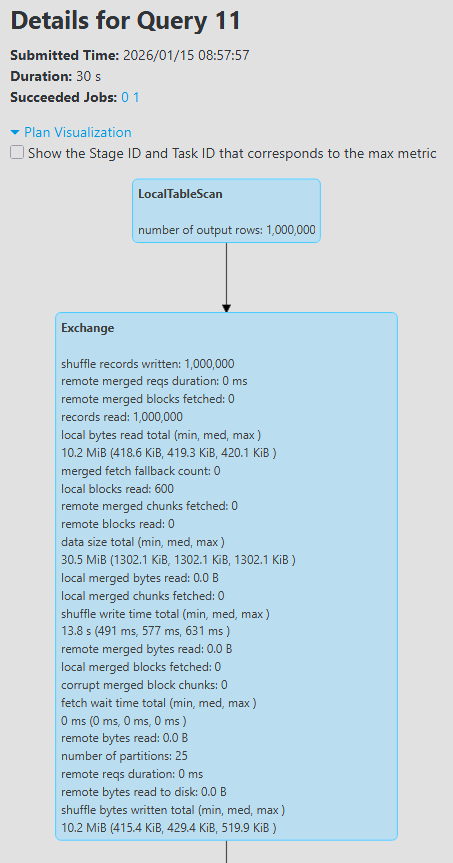
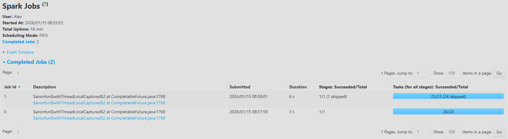
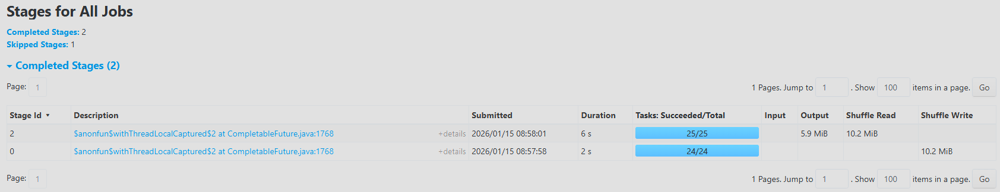

# Exercise 1 – create table, repartition, insertInto

## Code used

```scala
val ds = spark.createDataset((1 to 1000000).map(x => (s"$x", x % 100)))

// TEST_PART1:
spark.sql("drop table if exists db1.test_part1");
spark.sql("create table db1.test_part1 (col1 string) partitioned by (part1 int) stored as parquet");
ds.repartition(25).write.mode("overwrite").insertInto("db1.test_part1");
```

The dataset `ds` contains 1,000,000 rows, with a logical schema `(col1: string, part1: int)` where `part1 = x % 100`. 
The table `db1.test_part1` is a Hive table partitioned on `part1` and stored as parquet in the Spark warehouse.

---

## Question 1 – Directory and files structure

The table `db1.test_part1` is stored in the Spark/Hive metastore directory, typically:

- Base directory of the database: `.../spark-warehouse/db1.db/`.  
- Table directory: `.../spark-warehouse/db1.db/test_part1/`. 
- Inside this directory, Spark creates one subdirectory per partition value of `part1`, from `0` to `99`:  
  - `part1=0/`, `part1=1/`, …, `part1=99/`.

Each `part1=k/` directory contains one or several parquet files with names such as:

- `part-*****.snappy.parquet` (exact names depend on the run).

So the logical structure is:

- 1 root directory for the table.  
- 100 partition subdirectories (`part1=0` to `part1=99`).  
- Parquet files stored inside each partition directory.

---

## Question 2 – Description of the `insertInto` action

The following call triggers the main action:

```scala
ds.repartition(25)
  .write
  .mode("overwrite")
  .insertInto("db1.test_part1")
```

Step‑by‑step description:

- `repartition(25)` performs a **wide transformation** with a shuffle in order to produce 25 physical RDD partitions containing the 1,000,000 rows. 
- The operation `write.mode("overwrite").insertInto("db1.test_part1")` then:  
  - removes any previous content of the table (`overwrite`),  
  - maps dataset columns to the table columns (`col1`, `part1`),  
  - routes each row to the disk partition corresponding to its `part1` value (directory `part1=k`),  
  - writes the data as parquet files and updates Hive metadata (partition statistics).

In Spark UI (SQL tab → Plan visualization), the physical plan contains an operator `Execute InsertIntoHadoopFsRelationCommand` which writes 1,000,000 rows into 100 dynamic partitions (`part1`) across multiple parquet files.

---

## Question 3 – How Spark executes the action

### 3.1 Number of distinct partition values

Column `part1` is defined as `x % 100` for `x` ranging from 1 to 1,000,000, giving exactly 100 possible values: `0, 1, 2, …, 99`.
Spark UI confirms this via the insert operator which reports `number of dynamic part: 100`, i.e. 100 logical table partitions.

### 3.2 How RDD partitions are divided

Before `repartition`, dataset `ds` has 24 RDD partitions (measured with `ds.rdd.getNumPartitions`).
`repartition(25)` forces a shuffle that redistributes data into **25 physical RDD partitions**, as shown in the `Exchange` block of the plan (`number of partitions: 25`).

Each RDD partition contains a subset of rows with a mix of many different `part1` values (not a single `part1` per RDD partition), because this `repartition(25)` uses only the target number of partitions and not a specific key column.

### 3.3 Jobs, stages, tasks, and side effects of each task

The insert triggers a Spark job associated with the SQL `INSERT INTO db1.test_part1`.  

Spark UI shows that this query is executed as one main job with two completed stages (plus one skipped stage due to optimizations), and these stages correspond to the shuffle and the final write.  

- The job DAG contains:
  - one **shuffle stage** (operator `Exchange`) implementing `repartition(25)`,  
  - one **write stage** executing `WriteFiles` and then `InsertIntoHadoopFsRelationCommand`.  

In the **Jobs** and **Stages** pages, the shuffle and write stages respectively run **24/24** and **25/25** tasks, which is consistent with the 25 RDD partitions created after `repartition(25)` and with the initial 24 partitions before the shuffle.  

Role of the tasks:

- In the shuffle stage, each task reads part of the input data and writes shuffled data for the 25 target partitions, as shown by the shuffle read/write statistics.  
- In the write stage, each task consumes one RDD partition, applies the necessary projection/sort and writes rows into parquet files under the appropriate `part1=k` directories while updating partition statistics, as reported in the `Execute InsertIntoHadoopFsRelationCommand` node.  

---

## Question 4 – Number of parquet files written

In the detailed execution plan (SQL tab → Plan visualization → `Execute InsertIntoHadoopFsRelationCommand`), Spark UI reports:

- `number of output rows: 1,000,000`  
- `number of dynamic part: 100`  
- **`number of written files: 2,500`** 

This means:

- The 1,000,000 rows are distributed across 100 logical partitions (`part1` from 0 to 99).
- The physical write produces **2,500 parquet files** in total, which corresponds to an average of 25 files per partition value (`2,500 / 100 = 25`), even though the exact per‑partition count may slightly vary. 

On disk, under `.../spark-warehouse/db1.db/test_part1/`, there are therefore 100 `part1=k` subdirectories containing in total 2,500 `*.parquet` files.

---

## Question 5 – Justification with Spark UI (screenshots)

The previous answers must be backed up with screenshots taken from Spark UI.

- SQL tab → plan visualization showing `Execute InsertIntoHadoopFsRelationCommand` with 1,000,000 output rows, 100 dynamic partitions and 2,500 written files.


- Job page showing the DAG with the shuffle stage and the write stage.


- Stage page (Tasks tab) showing the ~25 tasks and their per‑partition timings and I/O.

